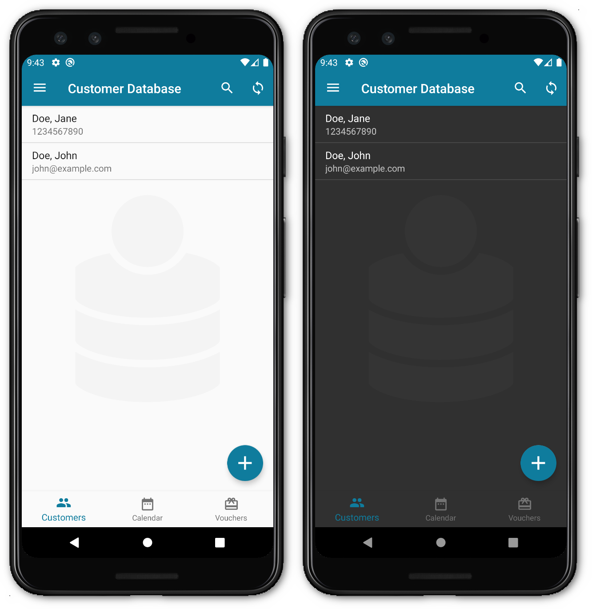

# Customer Database Android

With this Android app you can manage your customers separated from the private contacts, business appointments and vouchers. It is also available for [iOS](https://github.com/schorschii/customerdb-ios).

Optionally, you can set up your own sync server using the [Customer Database Server](https://github.com/schorschii/customerdb-server), which is also Open Source.

Contributions welcome :-)

## Screenshots

